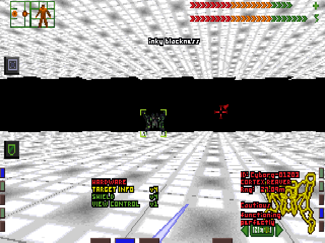

## Cortex Reaver Challenge

This was the "original" first fan mission for System Shock.
Though not as fancy as the one hitting the news, it was at least a milestone and proof-of-concept for
the first editor of [InkyBlackness](https://inkyblackness.github.io/).

### Synopsis

The player starts in a big room, with a Laser Rapier, targeting hardware and a shield hardware placed in front of them,
and they have to fight an endless stream of Cortex Reavers. Energy charge stations are in the four corners, and players must be careful
which ones they use.

How many reavers can you slay? There is no restoration chamber...

### Installation Instructions

#### System Shock Enhanced Edition, Source Port

* Copy the entire sub-folder `cortex-reaver-challenge` to `%APPDATA%\Nightdive Studios\System Shock EE\missions`
* Start the game
* Under `modifications`, `missions` select `Cortex Reaver Challenge`
* Start a new game
* Enjoy

#### [Shockolate](https://github.com/Interrupt/systemshock)

Refer to current readme of the engine how to run another mission.

#### Classic engines

Copy the `archive.dat` file from the `cortex-reaver-challenge/crc-data` sub-folder over the original file in the directory of the resources.
Be sure to keep a backup of the original.

### Requirements

* Any release version of System Shock 1
* New game to be started with combat level of at least 1 (uses enemy spawn triggers)

### Technical Details

Simple showcase of trigger chains with level-entry-trigger and ecology-trigger, spawning of objects, and energy stations.
Creation of this example is available as [YouTube video](https://www.youtube.com/watch?v=gC06pc9SzRc), using the older editor of InkyBlackness.
